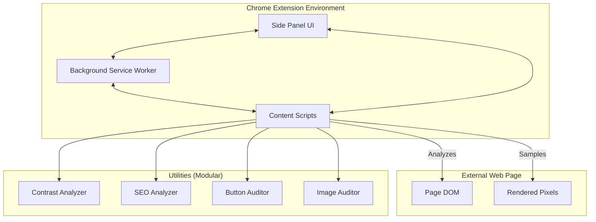

# Architecture Overview - SiteLens Extension

## 🏗️ System Overview

SiteLens is a decoupled browser extension designed for comprehensive web audits. It uses a three-tier architecture: **Side Panel (UI)**, **Background (Orchestrator)**, and **Content Scripts (Engine)**.

## 🔄 Core Components

### 1. The Controller: Side Panel (`src/sidepanel/`)
- **Responsibility**: User interaction, result display, and tool selection.
- **State Management**: Local variables in `sidepanel.js` (currently monolithic, planned for refactor).
- **Triggers**: Commands analysis by sending messages to Content Scripts.

### 2. The Orchestrator: Background Service Worker (`src/background/`)
- **Responsibility**: Lifecycle management, persistence, context menus, and high-privilege APIs (e.g., `captureVisibleTab`).
- **Storage**: Manages persistent settings and report history in `chrome.storage.local`.

### 3. The Engine: Content Scripts (`src/content/` & `src/utils/`)
- **Responsibility**: Directly interacts with the target webpage.
- **Analysis Pipeline**:
    1. **Traversal**: `dom-traverser.js` identifies relevant elements.
    2. **Detection**: `text-detector.js` filters content from UI.
    3. **Sampling**: `background-sampler.js` uses Canvas to determine "real" background colors.
    4. **Audit**: Specific analyzers (Contrast, SEO, etc.) perform checks.
    5. **Visualization**: `overlay.js` renders highlights and tooltips on the page.

## 📡 Messaging Protocol

- **`analyze`**: Sent from Side Panel to Content Script to start an audit.
- **`analysisComplete`**: Results sent back to Side Panel for display.
- **`saveReport`**: Sent to Background to persist results.
- **`initiateAreaScreenshot`**: Orchestrates interactive cropping between Side Panel and Background.

## 🛠️ Design Patterns

- **Utility Injection**: Core logic is split into standalone scripts injected together via `manifest.json`.
- **Canvas-Pixel Sampling**: A hybrid approach using DOM style computation + Pixel-level verification for accurate contrast measurement.
- **Asynchronous Processing**: Analysis is divided into manageable chunks to prevent UI blocking on heavy pages.

## 🔴 Architectural Debt (From ROADMAP.md)

1. **Side Panel Monolith**: `sidepanel.js` needs to be decomposed into feature-specific modules.
2. **CSP Vulnerabilities**: External dependencies should be bundled locally to ensure stability on high-security domains.
3. **Report Scalability**: Currently centralized in memory, large reports may need better streaming or storage strategies.
